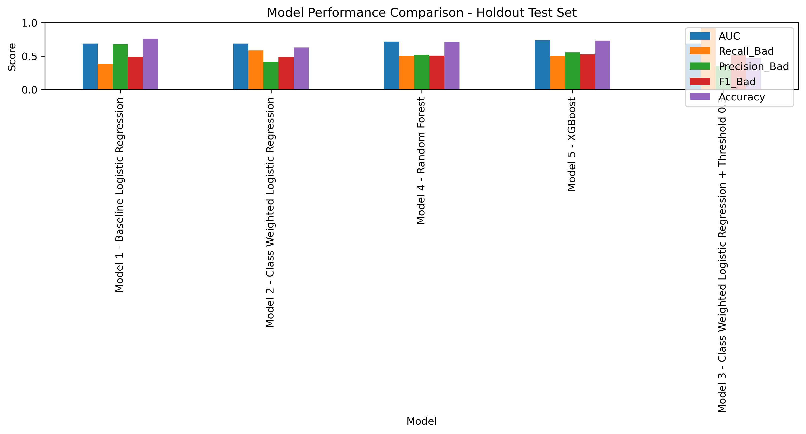
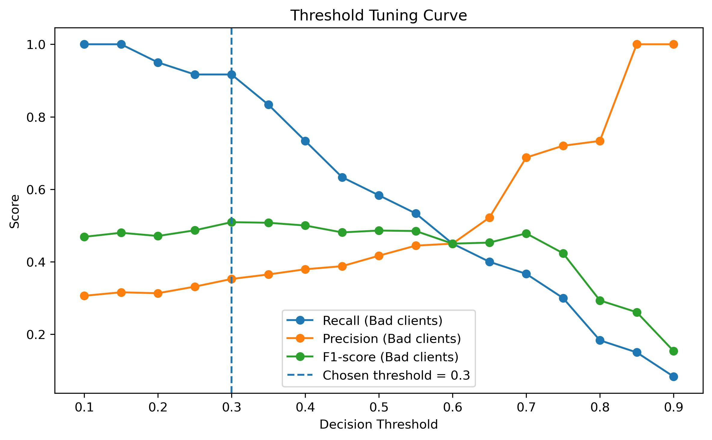
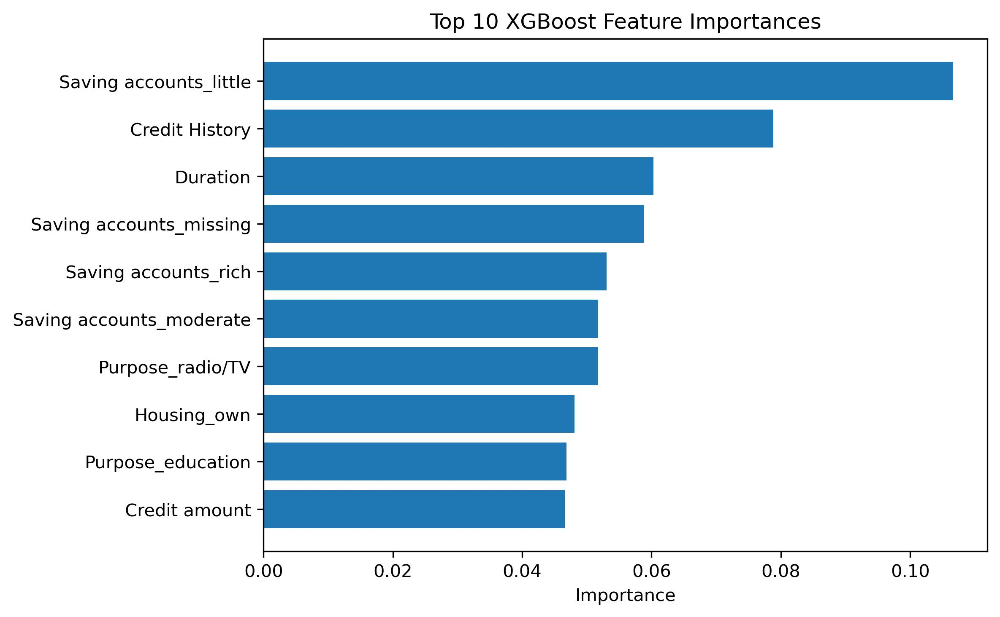
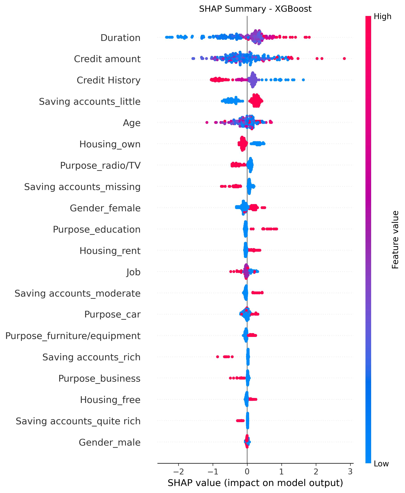

# Credit risk modelling project using machine learning to predict loan default probability

## Project Overview

This project develops a machine learning pipeline to predict credit risk using the German Credit dataset.

The objective is to classify applicants into:

* Good credit risk (0)
* Bad credit risk (1)

In financial contexts, accurately identifying high-risk clients is critical to:

* Reduce default rates
* Improve lending decisions
* Minimize financial losses

In a financial context, failing to identify risky clients can lead to financial losses.

---

## Key Objective

Unlike standard classification tasks, this project prioritizes maximizing recall for bad clients

This ensures that risky applicants are not incorrectly approved or classified as safe, which is a key requirement in real-world credit risk systems.

---

## Quick Start

### 1. Clone the repository

```bash
git clone https://github.com/LyndaLyndaLynda/credit-risk-modelling.git
cd credit-risk-modelling
```

### 2. Create a virtual environment (recommended)

```bash
python -m venv venv
```

Activate it:
Mac/Linux:

```bash
source venv/bin/activate
```

Windows:

```bash
venv\Scripts\activate
```

### 3. Install dependencies

```bash
pip install -r requirements.txt
```

### 4. Launch the notebook

```bash
jupyter notebook
```

** Alternative: run the script

```bash
python src/pipeline.py
```

---

## Dataset

Source: German Credit Dataset
Size: ~1000 observations

### Important note on dataset version

During development, two versions of the German Credit dataset were encountered:

* `german_credit_data.csv` → often does **NOT include the target variable**
* Correct dataset → includes the `Risk` column

Target encoding:

* good → 0
* bad → 1

Verifying this column is a **critical data-quality step**.

---

## Exploratory Data Analysis

Key insights:

* Dataset is imbalanced (~70% good, 30% bad)
* Missing values in `Saving accounts`
* **Duration** is higher for bad-risk clients
* **Credit amount** shows more extreme values for bad clients
* Moderate correlation between **Credit amount and Duration (~0.62)**

These insights align with real-world credit risk drivers:

* exposure size
* repayment horizon
* financial stability

---

## Methodology

### Pipeline

1. Data loading & validation
2. Target encoding (`good = 0`, `bad = 1`)
3. Stratified train-test split (80/20)
4. Preprocessing:

   * Numerical → imputation + scaling
   * Categorical → imputation + OneHotEncoding
5. Model training
6. Evaluation:

   * AUC
   * Recall
   * Precision
   * F1-score
   * Confusion Matrix
7. Cross-validation (robustness)
8. Explainability (coefficients + feature importance + SHAP)

### Why 80/20 split?

> An 80/20 train-test split was selected as a standard compromise between training set size and test reliability. Although alternative splits such as 70/30 may produce slightly different results, performance can vary due to sampling variability. For a more robust assessment, cross-validation was also used.

---

## Notebook Documentation

All steps of the analysis are fully explained in the notebook, including:

- Data cleaning and preprocessing  
- Exploratory Data Analysis (EDA)  
- Model selection and evaluation  
- Interpretation of all graphs and visualizations  
- Explainability (feature importance and SHAP)  

The notebook is designed as a complete, step-by-step walkthrough, making the project easy to understand from both a technical and business perspective.

---

## Models Implemented

| Model                              | Purpose                |
| ---------------------------------- | ---------------------- |
| Logistic Regression                | Interpretable baseline |
| Class-Weighted Logistic Regression | Improve recall         |
| Logistic + Threshold (0.3)         | High-risk detection    |
| Random Forest                      | Non-linear modelling   |
| XGBoost                            | Best performance       |

---

## Results

### Model Performance Comparison


### Key findings

* **Baseline Logistic Regression**

  * High accuracy
  * Low recall → misses risky clients

* **Class-Weighted Logistic Regression**

  * Better recall
  * Best interpretable model

* **Threshold Model (0.3)**

  * Recall ≈ 0.92
  * Many false positives
  * Strong screening model

* **Random Forest**

  * Balanced performance
  * Handles non-linearity

* **XGBoost**

  * Best AUC (~0.73)
  * Best overall model

---

## Interpretation

The project becomes interesting because it shows that:

* the baseline model favors overall accuracy
* class weighting improves risky-client detection
* lowering the threshold strongly boosts recall
* but higher recall comes with many false positives

> This is a real-world financial trade-off.

---

## Model Positioning

* **Best interpretable model:** Class-Weighted Logistic Regression
* **Best high-recall model:** Threshold (0.3)
* **Best overall model:** XGBoost

---

## Threshold Optimization

A custom threshold (0.3) was applied:

### Threshold Optimization (Key Insight)


* Recall ↑ significantly
* Precision ↓
* False positives ↑

This demonstrates a core financial trade-off:

> Detecting more risky clients vs. incorrectly flagging safe ones

---

## Evaluation

* ROC Curve → XGBoost best
* Precision-Recall → class imbalance visible
* Confusion matrices → trade-offs clearly shown
* Threshold curve → decision impact visualized

---

## Feature Importance

### Feature Importance (XGBoost)


Top features:

* Credit amount
* Duration
* Credit history
* Saving accounts
* Age

> These align with real-world credit scoring logic.

---

## Explainability (SHAP)

SHAP was used to:

* understand model behaviour
* identify drivers of risk
* ensure transparency

### Model Explainability (SHAP - XGBoost)


Key insights:

* Duration ↑ → Risk ↑
* Credit amount ↑ → Risk ↑
* Low savings → Risk ↑

> This is critical in financial applications where decisions must be explainable.

---

## Business Impact

This model can support:

* Loan approval systems
* Risk scoring engines
* Credit portfolio management

---

## Project Structure
```bash
credit-risk-modelling/
├── data/
├── notebook/        # Jupyter notebook with full analysis
├── src/             # Production-ready script
├── outputs/
│   ├── figures/
│   └── results/
└── README.md
```
---

## Key Takeaway

This project demonstrates that:

* Machine learning must align with business objectives
* Accuracy alone is not enough
* Risk-sensitive modelling requires trade-off analysis

> We prioritize recall to minimize false negatives, meaning risky clients incorrectly classified as safe.

---

## Future Improvements

* Hyperparameter tuning
* SMOTE / resampling
* Cost-sensitive learning
* Model calibration
* Deployment (API / dashboard)

---

## Author

* Lynda Djellouli
   * MSc Data Science
   * Machine Learning & Financial Risk Analytics

---

## Final Note

This project demonstrates:

* End-to-end ML pipeline
* Business-oriented thinking
* Explainability (SHAP)
* Financial risk awareness
